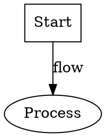
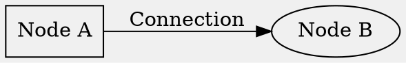
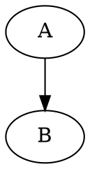
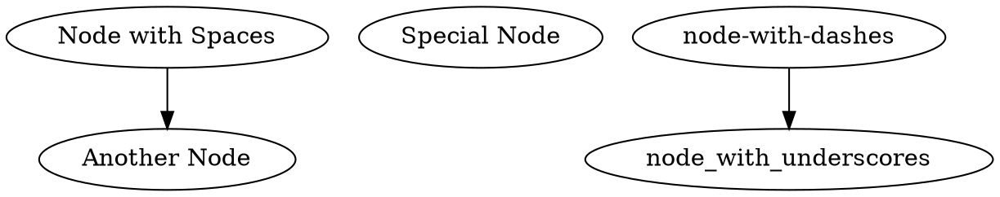
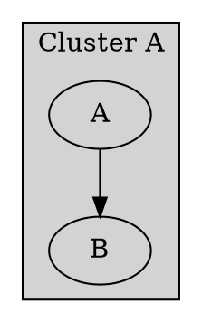
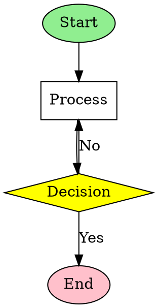
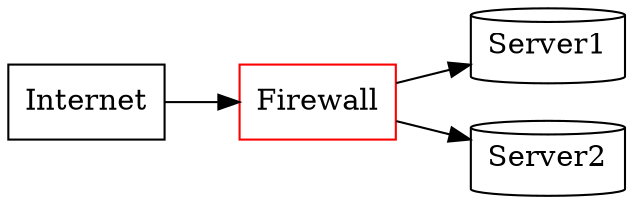
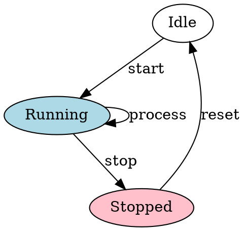

# User Guide

## Graphviz to Lucidchart Converter

### Quick Start (5 minutes)

1. **Start the Application**
   ```bash
   npm install
   npm run dev
   ```
   Open http://localhost:3000 in your browser

2. **Upload Your DOT Files**
   - Drag and drop DOT files onto the upload area
   - Or click to browse and select files
   - Supports `.dot` and `.gv` extensions

3. **Choose Export Format**
   - **draw.io XML**: For importing via draw.io integration
   - **Lucid Standard Import**: Direct .lucid file import

4. **Convert and Download**
   - Click "Convert All"
   - Download the ZIP file with converted results

---

## Table of Contents
1. [Getting Started](#getting-started)
2. [Web Interface Guide](#web-interface-guide)
3. [Command Line Usage](#command-line-usage)
4. [Supported DOT Syntax](#supported-dot-syntax)
5. [Export Formats](#export-formats)
6. [Examples](#examples)
7. [Troubleshooting](#troubleshooting)
8. [FAQ](#faq)

## Getting Started

### What This Tool Does
The Graphviz to Lucidchart Converter transforms your DOT diagram files into formats that can be imported into Lucidchart, preserving:
- Node positions and layouts
- Shapes and styles
- Colors and fonts
- Edge connections and labels
- Clusters/subgraphs

### System Requirements
- **Browser**: Chrome 90+, Firefox 88+, Safari 14+, or Edge 90+
- **Node.js**: Version 16+ (for local installation)
- **Memory**: 512MB minimum, 1GB recommended
- **Disk Space**: 100MB for application

## Web Interface Guide

### Main Interface Components

#### 1. File Upload Area
The drag-and-drop zone accepts DOT files:
- **Drag files** directly from your file manager
- **Click** to open file browser
- **Multiple files** supported for batch conversion
- File validation ensures only `.dot` or `.gv` files

#### 2. Export Options Panel
Located on the right side:

**Output Format Selection:**
- **draw.io XML** ✓
  - Best for: Integration with draw.io
  - File size: Smaller
  - Import via: draw.io → Lucidchart
  
- **Lucid Standard Import**
  - Best for: Direct Lucidchart import
  - File size: Larger (includes metadata)
  - Import via: Lucidchart import menu

**Features:**
- ✓ Preserves node labels and shapes
- ✓ Maintains colors and styles
- ✓ Supports clusters and subgraphs
- ✓ Accurate layout positioning

#### 3. File List
Shows uploaded files with status indicators:
- ⏱️ **Pending**: Waiting to process
- 🔄 **Processing**: Currently converting
- ✅ **Success**: Conversion complete
- ❌ **Error**: Conversion failed (hover for details)

#### 4. Preview Panel
Displays the first uploaded file:
- Real-time rendering
- Zoom and pan support
- Error messages if parsing fails

### Step-by-Step Conversion

#### Step 1: Prepare Your DOT Files
Ensure your DOT files are valid Graphviz syntax:


#### Step 2: Upload Files
1. Open the converter in your browser
2. Drag DOT files to the upload area
3. Files appear in the list with "Pending" status

#### Step 3: Select Export Format
Choose based on your needs:
- **draw.io XML**: If you have draw.io integration
- **Lucid Standard**: For direct Lucidchart import

#### Step 4: Convert Files
1. Click the **"Convert All"** button
2. Watch progress indicators for each file
3. Green checkmarks indicate success

#### Step 5: Download Results
1. Click **"Download ZIP"** button
2. Save the ZIP file to your computer
3. Extract files for import

#### Step 6: Import to Lucidchart

**For draw.io XML files:**
1. Open Lucidchart
2. File → Import → draw.io
3. Select your `.drawio` file
4. Adjust as needed

**For Lucid Standard files:**
1. Open Lucidchart
2. File → Import → Lucid
3. Select your `.lucid` file
4. Document opens directly

## Command Line Usage

### Installation
```bash
# Global installation
npm install -g graphviz-lucid-converter

# Or use locally
npm install
```

### Basic Commands

#### Convert Single File
```bash
gvlc --in diagram.dot --out-format drawio --out ./output
```

#### Convert Multiple Files
```bash
gvlc --in "*.dot" --out-format lucid --out ./converted
```

#### With Options
```bash
gvlc --in "src/**/*.dot" --out-format drawio --out ./output --verbose
```

### CLI Options
| Option | Description | Default |
|--------|-------------|---------|
| `--in` | Input file(s) or pattern | Required |
| `--out-format` | `drawio` or `lucid` | `drawio` |
| `--out` | Output directory | `./out` |
| `--verbose` | Detailed output | `false` |
| `--help` | Show help | - |
| `--version` | Show version | - |

## Supported DOT Syntax

### Basic Structure


### Node Attributes
| Attribute | Description | Example |
|-----------|-------------|---------|
| `label` | Node text | `label="My Node"` |
| `shape` | Node shape | `shape=box` |
| `color` | Border color | `color=blue` |
| `fillcolor` | Background | `fillcolor=lightblue` |
| `style` | Visual style | `style=filled` |
| `fontsize` | Text size | `fontsize=14` |
| `fontname` | Font family | `fontname="Arial"` |

### Supported Shapes
- `box`, `rectangle` → Rectangle
- `ellipse`, `circle` → Ellipse
- `diamond` → Diamond/Decision
- `cylinder` → Cylinder/Database
- `parallelogram` → Parallelogram
- `hexagon` → Hexagon
- `triangle` → Triangle

### Edge Attributes
| Attribute | Description | Example |
|-----------|-------------|---------|
| `label` | Edge text | `label="Yes"` |
| `color` | Line color | `color=red` |
| `style` | Line style | `style=dashed` |
| `penwidth` | Line width | `penwidth=2` |
| `arrowhead` | Arrow style | `arrowhead=diamond` |

### Special Features

#### Comments


#### Quoted Identifiers


#### Clusters/Subgraphs


## Export Formats

### draw.io XML Format
**File Extension**: `.drawio`
**Structure**: mxGraph XML format
**Best For**: 
- Integration with draw.io
- Smaller file sizes
- Web-based editing

**Import Process**:
1. Open Lucidchart
2. Use draw.io integration
3. Import XML file
4. Edit and save

### Lucid Standard Import
**File Extension**: `.lucid`
**Structure**: ZIP containing JSON
**Best For**:
- Direct Lucidchart import
- Preserving all attributes
- Complex diagrams

**Import Process**:
1. Open Lucidchart
2. File → Import → Lucid
3. Select .lucid file
4. Opens immediately

## Examples

### Example 1: Simple Flowchart


### Example 2: Network Diagram


### Example 3: State Machine


## Troubleshooting

### Common Issues

#### "Failed to parse DOT file"
**Cause**: Invalid DOT syntax
**Solution**: 
- Check for unclosed quotes or brackets
- Remove special characters at end of file
- Validate syntax with Graphviz tools

#### "Preview not showing"
**Cause**: Browser compatibility or large file
**Solution**:
- Update browser to latest version
- Try smaller file first
- Check browser console for errors

#### "Conversion takes too long"
**Cause**: Large or complex graph
**Solution**:
- Break into smaller diagrams
- Simplify node attributes
- Remove unnecessary edges

#### "Import fails in Lucidchart"
**Cause**: Format compatibility
**Solution**:
- Try alternative format (draw.io vs Lucid)
- Check Lucidchart import limits
- Simplify diagram structure

### Error Messages

| Error | Meaning | Solution |
|-------|---------|----------|
| "Expected comment, end of input or whitespace but '/' found" | Invalid comment syntax | Check for stray `/` characters |
| "File too large" | Exceeds size limit | Split into smaller files |
| "Invalid node identifier" | Node name issues | Use quotes for special names |
| "Layout computation failed" | WASM error | Refresh browser and retry |

## FAQ

### General Questions

**Q: Is my data sent to any server?**
A: No, all processing happens locally in your browser. No data leaves your device.

**Q: What's the maximum file size?**
A: The practical limit is about 10MB per DOT file, though performance degrades with very large files.

**Q: Can I convert multiple files at once?**
A: Yes, the web interface supports batch processing of multiple files.

**Q: Which format should I use for Lucidchart?**
A: Try draw.io XML first (smaller, faster). Use Lucid Standard if you need perfect attribute preservation.

### Technical Questions

**Q: What DOT features aren't supported?**
A: HTML-like labels, record shapes, and some advanced attributes have limited support.

**Q: Can I use this offline?**
A: Yes, once loaded, the application works entirely offline.

**Q: How accurate is the layout?**
A: We use the same Graphviz layout engine (via WebAssembly), so positioning is identical to Graphviz output.

**Q: Can I customize the conversion?**
A: Currently, customization is limited to format selection. More options planned for future versions.

### Import Questions

**Q: Why doesn't my diagram look exactly the same in Lucidchart?**
A: Some Graphviz features don't have exact equivalents in Lucidchart. We map to the closest available options.

**Q: Can I edit the diagram after import?**
A: Yes, once imported to Lucidchart, it becomes a regular Lucidchart diagram with full editing capabilities.

**Q: Do formulas and constraints transfer?**
A: No, only visual elements transfer. Logical constraints must be recreated in Lucidchart.

### Support

For issues, feature requests, or contributions:
- GitHub Issues: [Report problems or suggestions]
- Documentation: Check this guide and technical docs
- Examples: See the `examples/` folder for sample files